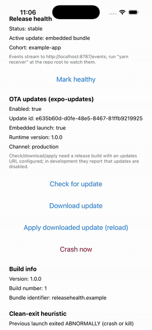
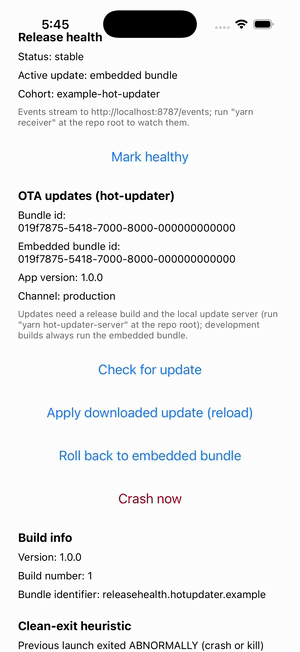

# react-native-release-health

[](https://github.com/release-health/react-native-release-health/actions/workflows/ci.yml)
[](https://www.npmjs.com/package/react-native-release-health)
[](./LICENSE)

Vendor-neutral OTA rollout safety for React Native. Tag every session with the active update and native version, put fresh updates on probation, detect failed or crash-looping rollouts on the device, recommend (or trigger) rollback, and export the whole story to any sink you like. Works with your OTA vendor, not against it.

<table>
<tr>
<td align="center"><b>expo-updates</b>: crash loop detected on the second launch, rollback recommended</td>
<td align="center"><b>hot-updater</b>: crash loop detected, rolled back to the embedded bundle automatically</td>
</tr>
<tr>
<td></td>
<td></td>
</tr>
</table>

Both recordings are real: a deliberately crashing update published to a real update server, driven on a release build in the iOS simulator. The runbooks to reproduce them are in [docs/demo.md](docs/demo.md) and [docs/demo-hot-updater.md](docs/demo-hot-updater.md).

## The problem

OTA updates ship JavaScript straight to production. When one of them is broken, nothing in the default stack notices: the update applies, the app crashes on launch, the user relaunches, it crashes again. Your crash reporter sees a spike but cannot tell you which update caused it or whether the fix is to roll back. Your OTA dashboard shows the download count going up and nothing else. The delivery pipelines are excellent; the feedback loop about whether a rollout actually works on devices is missing.

release-health closes that loop on the device:

1. Every launch is tagged with the active update id and native build.
2. A freshly applied update goes on **probation**. Your app calls `markHealthy()` once its first screen is genuinely interactive.
3. No `markHealthy()` within the timeout makes the update **suspect**. A crash or abnormal exit followed by a relaunch counts against it; hitting the crash-loop threshold makes it **failed**.
4. A failed update fires `rollback_recommended` (and `rollback_executed`, when the adapter supports client rollback and you opted in with `autoRollback`).
5. Every step is exported as a typed event stream to any sink: your own HTTP endpoint, Sentry tags and breadcrumbs, or anything that implements the two-method `Sink` interface.

## Quickstart

```sh
npm install react-native-release-health @release-health/adapter-expo-updates @release-health/sink-http
```

```tsx
import { useEffect } from 'react';
import { ReleaseHealth, useReleaseHealth } from 'react-native-release-health';
import { expoUpdatesAdapter } from '@release-health/adapter-expo-updates';
import { httpSink } from '@release-health/sink-http';

ReleaseHealth.init({
  adapter: expoUpdatesAdapter(),
  sinks: [httpSink({ url: 'https://telemetry.example.com/release-health' })],
  healthyTimeoutMs: 15000, // markHealthy() deadline after a fresh update
  crashLoopThreshold: 2,   // failed launches before rollback is recommended
});

function App() {
  // status: 'stable' | 'probation' | 'healthy' | 'suspect' | 'failed' | ...
  const { status, activeUpdateId } = useReleaseHealth();

  useEffect(() => {
    // Call when your first screen is actually usable, not merely rendered.
    ReleaseHealth.markHealthy();
  }, []);

  useEffect(
    () =>
      ReleaseHealth.onRollbackRecommended(({ updateId, reason }) => {
        // Page your on-call, disable the release server-side, or let
        // autoRollback handle it where the adapter supports rollback.
      }),
    []
  );

  return <YourApp />;
}
```

Using hot-updater instead? Swap the adapter and wire its callbacks into `HotUpdater.wrap`; see [@release-health/adapter-hot-updater](packages/adapter-hot-updater/README.md).

## Packages

| Package | What it does |
| --- | --- |
| [react-native-release-health](packages/core/README.md) | Core: native build info, persisted launch flags, clean-exit heuristic, and the pure TypeScript health engine |
| [@release-health/adapter-expo-updates](packages/adapter-expo-updates/README.md) | Adapter for expo-updates (EAS Update). Recommendation-only: expo-updates has no client rollback API |
| [@release-health/adapter-hot-updater](packages/adapter-hot-updater/README.md) | Adapter for hot-updater, including client-side `rollback()` and `autoRollback` support |
| [@release-health/sink-http](packages/sink-http/README.md) | Batching HTTP sink: posts the event stream as JSON to any endpoint |
| [@release-health/sink-sentry](packages/sink-sentry/README.md) | Sentry sink: tags every Sentry event with `ota.update_id` and `ota.status`, plus breadcrumbs |

Adapters and sinks are peer-based and duck-typed: none of them hard-depend on the vendor SDK, and every one degrades to a safe no-op with a single actionable warning instead of crashing the host app.

## The event stream

Every sink receives the same typed events (`sessionId` and `timestamp` on all of them):

| Event | Fired when |
| --- | --- |
| `session_start` | Every launch, with update id, native version, build number, platform, cohort |
| `update_downloaded` | The adapter reports a new update ready to apply |
| `update_apply_success` | A probation update was marked healthy |
| `update_apply_failed` | Probation failed (crash loop or timeout chain), with a reason |
| `crash` | A fatal JS error was caught in this session |
| `healthy` | `markHealthy()` accepted, with time-to-healthy |
| `rollback_recommended` | An update was judged failed, with `crash-loop` or `apply-failed` |
| `rollback_executed` | `autoRollback` ran the adapter's `rollback()`, with success flag |

## How failure detection works

Crash detection needs no crash SDK: the native module records a clean-exit flag on graceful background or terminate, so a launch that follows neither is treated as an abnormal exit. Fatal JS errors are additionally caught in-session through the global error handler. The engine counts consecutive failed probation launches, judged at launch start, so the crash-loop verdict lands even when the crash itself killed the process before anything could be sent. Dev reloads never count (`__DEV__` short-circuits probation), and an intentional `reloadAsync`-style apply mid-probation restarts the probation timer instead of counting as a failure.

This heuristic is deliberately honest about what it is: it detects "the app did not exit cleanly", not "the app crashed at this stack trace". Pair it with a crash reporter for ground truth; the [Sentry sink](packages/sink-sentry/README.md) exists exactly for that. Read [docs/limitations.md](docs/limitations.md) before relying on it.

## Compatibility

| | Supported |
| --- | --- |
| react-native | 0.76 or newer, New Architecture only (TurboModule, bridgeless). Developed against 0.83 |
| Platforms | iOS and Android |
| Expo | Yes. No config plugin needed for the core module; the example apps are Expo SDK 55 dev clients |
| expo-updates | 55.0.0 or newer (adapter peer) |
| @hot-updater/react-native | 0.35.0 or newer (adapter peer) |
| @sentry/react-native | 7.0.0 or newer (sink peer) |
| Legacy architecture | Not supported |

## Alternatives, honestly

| | Delivers updates | On-device health verdict | Rollback loop | Vendor-neutral |
| --- | --- | --- | --- | --- |
| EAS Update / expo-updates | Yes | No | Server-side, manual | No |
| hot-updater | Yes | First-launch native crash guard | Server-side console | No |
| Sentry release health | No | Crash-free session rates, per release | No | Yes |
| **react-native-release-health** | No, on purpose | Probation, crash-loop, per update id | Recommends; executes where the vendor allows | Yes |

The delivery vendors are good at delivery, and Sentry is good at crash truth. This library is the missing piece between them: the on-device judgment of whether the rollout you just shipped is healthy, expressed per update id, with a rollback recommendation you can automate. It deliberately does not deliver updates, host a dashboard, or symbolicate crashes.

- hot-updater's own crash guard covers startup crashes before the first frame; release-health covers everything from the first frame until your app proves itself interactive. The two compose, see the [adapter README](packages/adapter-hot-updater/README.md).
- Sentry's release health tracks native releases and sessions; it does not know which OTA bundle was active. The [Sentry sink](packages/sink-sentry/README.md) adds exactly that segmentation to every issue.

## Demos

- [docs/demo.md](docs/demo.md): full crash-loop runbook on expo-updates with a real EAS Update, including recovery via `eas update:roll-back-to-embedded`.
- [docs/demo-hot-updater.md](docs/demo-hot-updater.md): the same story on hot-updater, fully local (a self-hosted update server ships in this repo), including automatic client rollback.
- [docs/limitations.md](docs/limitations.md): what this library can and cannot detect. Read it before trusting it.
- [docs/test-matrix.md](docs/test-matrix.md): the manual native-behavior matrix run before releases.

## Contributing

See [CONTRIBUTING.md](CONTRIBUTING.md). The repo is a yarn 4 workspace monorepo; `yarn install`, then `yarn test` runs every package's suite. The health engine is pure TypeScript with 100% branch coverage on the state machine; keep it that way.

## License

MIT
